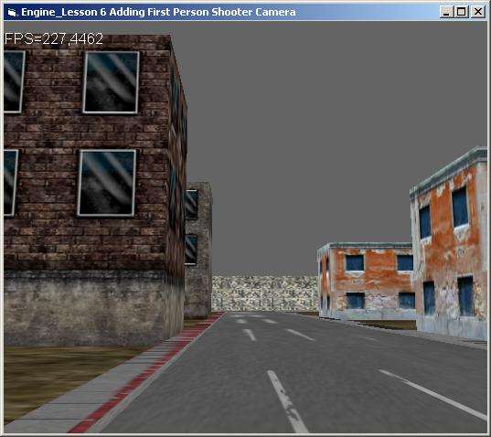



## A Quest to a 3D Engine Programming Lesson 6: Adding First Person Shooter Camera

### Description

This 6th tutorial of my Quest to a 3D Engine programming series, deals with Advanced Camera System, a new Camera Class has been Added. It handle both 6DOF (6 Degree of Freedom) and FPS camera. An Input Class have been implemented it handles All input devices (Keyboard,Mouse,Joystick..). Numerous bugs have been fixed thank to all your comments and feedbacks over the previous tutorials. this Step is very important, Now the Engine is quite okay for a little 3D game. We have to add,collision, Sky system, lensFlare, particle system. We will show how to add this modules in nest tutorials, Since then, enjoy my code and Vote, leave comments and feedbacks.

Polaris
 
### More Info
 

             |
---                |---
**Submitted On**   |2006-07-12 17:22:38
**By**             |[polaris](https://github.com/Planet-Source-Code/PSCIndex/blob/master/ByAuthor/polaris.md)
**Level**          |Beginner
**User Rating**    |4.7 (14 globes from 3 users)
**Compatibility**  |VB 5\.0, VB 6\.0
**Category**       |[DirectX](https://github.com/Planet-Source-Code/PSCIndex/blob/master/ByCategory/directx__1-44.md)
**World**          |[Visual Basic](https://github.com/Planet-Source-Code/PSCIndex/blob/master/ByWorld/visual-basic.md)
**Archive File**   |[A\_Quest\_to2006017122006\.zip](https://github.com/Planet-Source-Code/polaris-a-quest-to-a-3d-engine-programming-lesson-6-adding-first-person-shooter-camera__1-65939/archive/master.zip)

